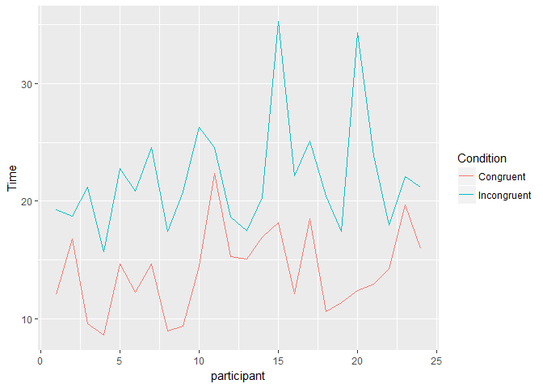
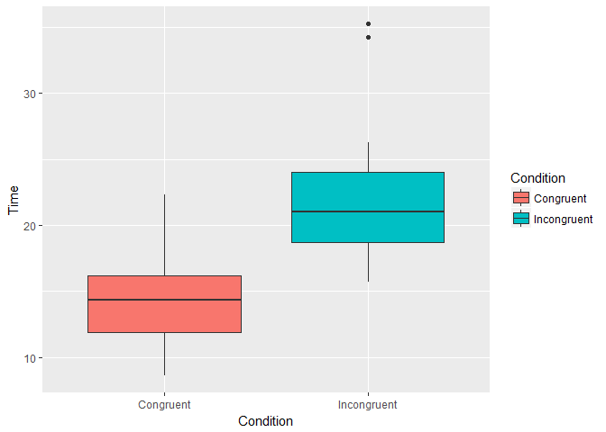

Questions For Investigation
---------------------------

### 1. What is our independent variable? What is our dependent variable?

-   Our independent variable is the condition of the word pairs - congruent(where color name and the ink color matches) or incongruent (color name and ink color do not match).
-   Our dependent variable is the time taken by the participants to name the ink colors in equally sized lists.

### 2. What is an appropriate set of hypotheses for this task? What kind of statistical test do you expect to perform? Justify your choices.

Hypothesis: Since population parameters are unknown, we will use the provided sample to make inferences about the population.

-   Null Hypothesis: there is no significant difference between the mean(mu) of time taken for congruent words condition and the incongruent words condition. H\_0: mu\_congruent = mu\_incongruent OR mu\_congruent - mu\_incongruent = 0 OR mu\_diff = 0

-   Alternate Hypothesis: there is a significant difference between the mean(mu) of time taken for incongruent words condition and for congruent words condition. H\_A: mu\_congruent != mu\_incongruent OR mu\_congruent - mu\_incongruent != 0 OR mu\_diff != 0

Considering that the samples are dependent and each of the participant has gone through both the conditions, the hypothesis test we perform will be two-sided paired dependent samples t-test.

### 3. Report some descriptive statistics regarding this dataset. Include at least one measure of central tendency and at least one measure of variability.

``` r
stroop <- read.csv('stroopdata.csv')
sapply(stroop, function(x) list(min = min(x), mean = mean(x), median = median(x), variance = var(x), st_dev =sd(x), iqr = IQR(x), max=max(x)))
```

    ##          Congruent Incongruent
    ## min      8.63      15.687     
    ## mean     14.05113  22.01592   
    ## median   14.3565   21.0175    
    ## variance 12.66903  23.01176   
    ## st_dev   3.559358  4.797057   
    ## iqr      4.3055    5.33475    
    ## max      22.328    35.255

### 4. Provide one or two visualizations that show the distribution of the sample data. Write one or two sentences noting what you observe about the plot or plots.

``` r
library(reshape2)
library(ggplot2)
library(dplyr)

#Adding another column for participant id 
stroop_participant <- mutate(stroop, participant = 1:nrow(stroop))

#Using melt function to get data into long format
stroop_long <- melt(stroop_participant, variable.name = "Condition", value.name = "Time", id.vars = c('participant'))

# Line graph for time taken for congruent condition vs Incongruent
ggplot(data = stroop_long, aes(x= participant , y = Time, colour=Condition))+geom_line()
```



From the line-graph, we can see that the time taken under Incongruent condition is more for each participant than time taken under congruent condition. We also see the two peaks for participant 15 and 20, time taken by these participants look unusually high as compared to others.

``` r
ggplot(data=stroop_long, aes(x= Condition, y = Time, fill=Condition))+ 
  geom_boxplot()
```



Since our independent variable is categorical, another visualization we can easily use is box-plot. In the above boxplot, we observe that the ranges for the conditions are very different. The range as well as the median for Incongruent condition is much higher than the Congruent condition. The boxplot also shows the two outliers that we observed in the above line-graph.

### 5. Now, perform the statistical test and report your results. What is your confidence level and your critical statistic value? Do you reject the null hypothesis or fail to reject it? Come to a conclusion in terms of the experiment task. Did the results match up with your expectations?

``` r
#Using the original dataset, find the time difference between Congruent and Incongruent for each participant
stroop_diff <- mutate(stroop, time_difference = (Congruent - Incongruent))

#Calculate point estimate or mean difference 
Xmean_diff <- signif((mean(stroop_diff$Congruent) - mean(stroop_diff$Incongruent)), 5)
n <- nrow(stroop_diff) #sample
deg_f <- n-1
S <- signif(sd(stroop_diff$time_difference),5) #standard deviation sd() uses n-1
SE <- signif(S/sqrt(n),5) #Standard Error
t= signif((Xmean_diff - 0) /SE,5) # T-statistic
pval <- signif(2*pt(t, deg_f, lower=T),5)

#Effect Size Measure - Cohen's D
Cohens_D <- signif(Xmean_diff/S,5)
```

``` r
cat("Mean Difference = ", Xmean_diff, "\nN = ", n, "\nDegrees of Freedom = ", deg_f, "\nSample Standard Deviation for mean differences (S) = ", S, "\nStandard error (SE) = ", SE, "\nT-statistic (t) = ", t, "\nP-Value = ", pval, "\nEffect Size Measure, Cohen's D = ", Cohens_D)
```

    ## Mean Difference =  -7.9648 
    ## N =  24 
    ## Degrees of Freedom =  23 
    ## Sample Standard Deviation for mean differences (S) =  4.8648 
    ## Standard error (SE) =  0.99302 
    ## T-statistic (t) =  -8.0208 
    ## P-Value =  4.1022e-08 
    ## Effect Size Measure, Cohen's D =  -1.6372

### Checking the ttest results using R inbuilt functions

``` r
t.test(x=stroop_diff$Congruent, y = stroop_diff$Incongruent, alternative = 'two.sided', paired = T)
```

    ## 
    ##  Paired t-test
    ## 
    ## data:  stroop_diff$Congruent and stroop_diff$Incongruent
    ## t = -8.0207, df = 23, p-value = 4.103e-08
    ## alternative hypothesis: true difference in means is not equal to 0
    ## 95 percent confidence interval:
    ##  -10.019028  -5.910555
    ## sample estimates:
    ## mean of the differences 
    ##               -7.964792

For alpha level 0f 0.05, t-critical values are (-2.069, 2.069). Since our t-statistic is less than the -2.069, we REJECT THE NULL HYPOTHESIS that there is no significant difference in the congruent or incongruent condition timings. Since the results are on the negative direction, we can also infer that participants took significantly less time under congruent condition than under incongruent condition. 95% Confidence Interval = (-10.019028, -5.910555) We can say that on average participants will take approximately 5 to 10 secs less for congruent words as compared to incongruent words. \`\`

### 6. Optional: What do you think is responsible for the effects observed? Can you think of an alternative or similar task that would result in a similar effect? Some research about the problem will be helpful for thinking about these two questions!

From personal stroop task results (for congruent words - 11.758 seconds and for incongruent words - 25.098 seconds), the first thing I observed was that reading words takes less time than naming the color. I believe that this is definitely responsible for the stroop effect. Also, while focusing on naming the color, the word often comes to mind. This is explained by 'Selective Attention Theory' - the interference occurs because naming colors requires more attention than reading words. (reference - <https://faculty.washington.edu/chudler/words.html>)

Other similar task are DIRECTIONAL Stroop Effect(congruent and incongruent pairs of names of directions and actual direction within a box) and Animal stroop efect(pairs of the names of actual animals shown in the picture vs. the words written on the picture.) (ref:<https://faculty.washington.edu/chudler/words.html>)

References
----------

-   <http://stackoverflow.com/questions/20794284/means-and-sd-for-columns-in-a-dataframe-with-na-values>
-   <http://stackoverflow.com/questions/3427457/ggplot-and-r-two-variables-over-time>
-   <https://www.r-bloggers.com/melt/>
-   <https://faculty.washington.edu/chudler/words.html>)
